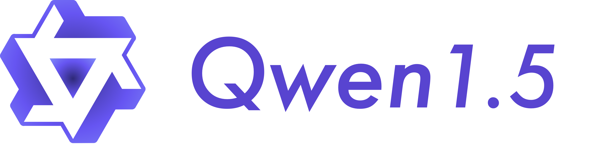

.. Qwen documentation master file, created by
   sphinx-quickstart on Tue Feb 20 21:16:41 2024.
   You can adapt this file completely to your liking, but it should at least
   contain the root `toctree` directive.

Welcome to Qwen!
================

Qwen is the large language model and large multimodal model series of the Qwen Team, Alibaba Group. Now the large language moels are upgraded to Qwen1.5. Both language models and multimodal models are pretrained on large-scale multilingual and multimodal data and post-trained on quality data for aligning to human preferences. Qwen is capable of natural language understanding, text generation, vision understanding, audio understanding, tool use, role play, playing as AI agent, etc. 

The latest version, Qwen1.5, has the following features:

* 6 model sizes, including 0.5B, 1.8B, 4B, 7B, 14B, and 72B;
* Base and chat models for each size, with the chat models aligned for human preferences;
* Multilingual support of both base and chat models;
* Stable support of 32K context length for models of all sizes
* Supporting tool use, RAG, role play, and playing as AI agent;

For more information, please visit our:

* `Blog <https://qwenlm.github.io/>`__
* `GitHub <https://github.com/QwenLM>`__
* `Hugging Face <https://huggingface.co/Qwen>`__
* `ModelScope <https://modelscope.cn/organization/qwen>`__
* `Qwen1.5 Collection <https://huggingface.co/collections/Qwen/qwen15-65c0a2f577b1ecb76d786524>`__

Join our community by joining our `Discord <https://discord.gg/yPEP2vHTu4>`__ and `WeChat <https://github.com/QwenLM/Qwen/blob/main/assets/wechat.png>`__ group. We are looking forward to seeing you there!

Documentation
-------------

.. toctree::
   :maxdepth: 1
   :caption: Getting Started

   getting_started/installation
   getting_started/quickstart

.. toctree::
   :maxdepth: 1
   :caption: Inference

   inference/chat

.. toctree::
   :maxdepth: 1
   :caption: Run Locally

   run_locally/llama.cpp
   run_locally/ollama

.. toctree::
   :maxdepth: 1
   :caption: Web UI

   web_ui/text_generation_webui

.. toctree::
   :maxdepth: 1
   :caption: Quantization

   quantization/awq
   quantization/gptq
   quantization/gguf

.. toctree::
   :maxdepth: 1
   :caption: Deployment

   deployment/vllm

.. toctree::
   :maxdepth: 2
   :caption: Training

   training/SFT/index