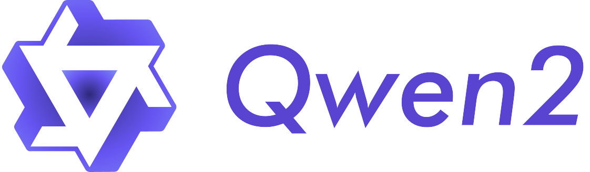

Welcome to Qwen!
================

Qwen is the large language model and large multimodal model series of the Qwen Team, Alibaba Group. Now the large language models have been upgraded to Qwen2. Both language models and multimodal models are pretrained on large-scale multilingual and multimodal data and post-trained on quality data for aligning to human preferences. 
Qwen is capable of natural language understanding, text generation, vision understanding, audio understanding, tool use, role play, playing as AI agent, etc. 

The latest version, Qwen2, has the following features:

* 5 sizes, including Qwen2-0.5B, Qwen2-1.5B, Qwen2-7B, Qwen2-57B-A14B, and Qwen2-72B;
* Base and instruction-tuned models for each size, with the instruction-tuned models aligned for human preferences;
* Multilingual support of both base and instruction-tuned models;
* Stable support of 32K context length for models of all sizes and up to 128K tokens with Qwen2-7B-Instruct and Qwen2-72B-Instruct;
* Supporting tool use, RAG, role play, and playing as AI agent;

For more information, please visit our:

* `Blog <https://qwenlm.github.io/>`__
* `GitHub <https://github.com/QwenLM>`__
* `Hugging Face <https://huggingface.co/Qwen>`__
* `ModelScope <https://modelscope.cn/organization/qwen>`__
* `Qwen2 Collection <https://huggingface.co/collections/Qwen/qwen2-6659360b33528ced941e557f>`__

Join our community by joining our `Discord <https://discord.gg/yPEP2vHTu4>`__ and `WeChat <https://github.com/QwenLM/Qwen/blob/main/assets/wechat.png>`__ group. We are looking forward to seeing you there!

.. toctree::
   :maxdepth: 1
   :caption: Getting Started
   :hidden:

   getting_started/quickstart
   getting_started/concepts
   
.. toctree::
   :maxdepth: 1
   :caption: Inference
   :hidden:

   inference/chat

.. toctree::
   :maxdepth: 1
   :caption: Run Locally
   :hidden:

   run_locally/ollama
   run_locally/mlx-lm
   run_locally/llama.cpp
   
.. toctree::
   :maxdepth: 1
   :caption: Web UI
   :hidden:

   web_ui/text_generation_webui

.. toctree::
   :maxdepth: 1
   :caption: Quantization
   :hidden:

   quantization/awq
   quantization/gptq
   quantization/llama.cpp

.. toctree::
   :maxdepth: 1
   :caption: Deployment
   :hidden:

   deployment/vllm
   deployment/tgi
   deployment/skypilot

.. toctree::
   :maxdepth: 2
   :caption: Training
   :hidden:

   training/SFT/index

.. toctree::
   :maxdepth: 1
   :caption: Framework
   :hidden:

   framework/function_call
   framework/qwen_agent
   framework/LlamaIndex
   framework/Langchain

.. toctree::
   :maxdepth: 1
   :caption: Benchmark
   :hidden:

   benchmark/quantization_benchmark
   benchmark/speed_benchmark
