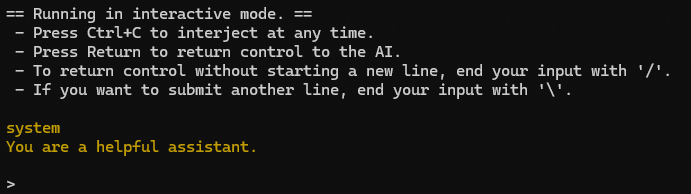
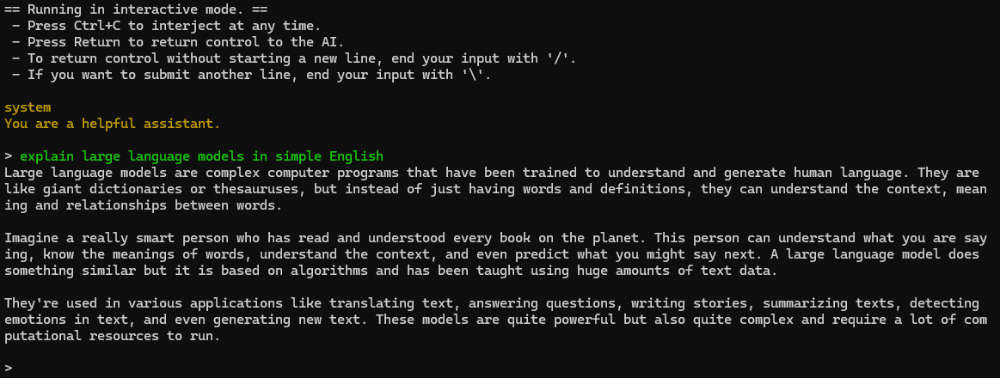
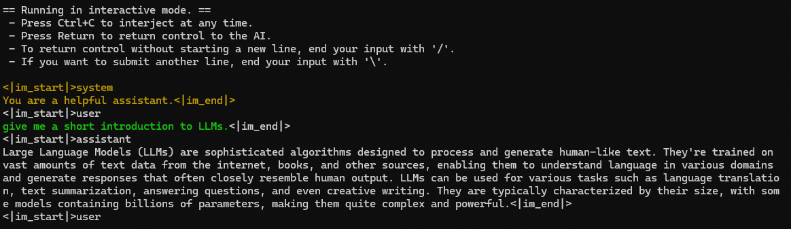
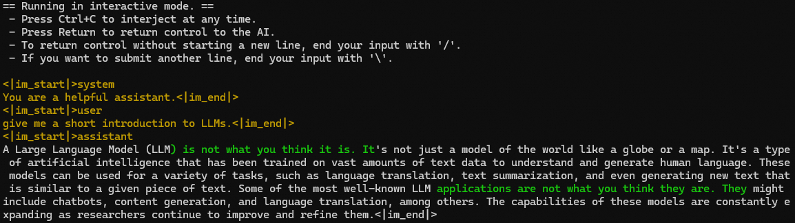
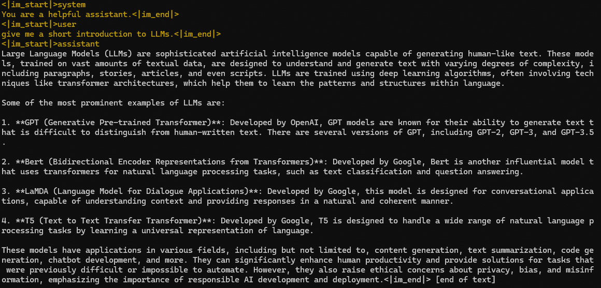
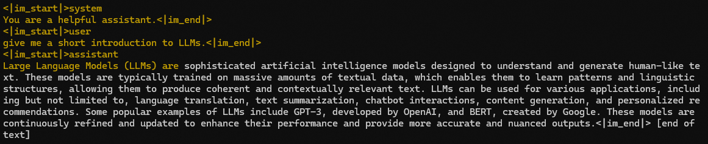

# llama.cpp

[^GGUF]: GPT-Generated Unified Format

In this guide, we will talk about how to "use" [llama.cpp](https://github.com/ggerganov/llama.cpp) to run Qwen2 models on your local machine, in particular, the `llama-cli` example program, which comes with the library.

--- 

Before starting, let's first discuss what is llama.cpp and what you should expect, and why we say "use" llama.cpp, with "use" in quotes.
llama.cpp is essentially a different ecosystem with a different design philosophy that targets light-weight footprint, minimal external dependency, multi-platform, and extensive, flexible hardware support:
- Plain C/C++ implementation without external dependencies
- Support a wide variety of hardware:
  - AVX, AVX2 and AVX512 support for x86_64 CPU
  - Apple Silicon via Metal and Accelerate (CPU and GPU)
  - NVIDIA GPU (via CUDA), AMD GPU (via hipBLAS), Intel GPU (via SYCL), Ascend NPU (via CANN), and Moore Threads GPU (via MUSA)
  - Vulkan backend for GPU
- Various quantization scheme for faster inference and reduced memory footprint
- CPU+GPU hybrid inference to partially accelerate models larger than the total VRAM capacity

It's like the Python frameworks `torch`+`transformers` or `torch`+`vllm` but in C++.
However, this difference is crucial: 
- Python is an interpreted language: 
  The code you write is executed line-by-line on-the-fly by an interpreter. 
  You can run the example code snippet or script with an interpreter or a natively interactive interpreter shell.
  In addition, Python is learner friendly, and even if you don't know much before, you can tweak the source code here and there.
- C++ is a compiled language: 
  The source code you write needs to be compiled beforehand, and it is translated to machine code and an executable program by a compiler.
  The overhead from the language side is minimal. 
  You do have source code for example programs showcasing how to use the library. 
  But it is not very easy to modify the source code if you are not verse in C++ or C.

To use llama.cpp means that you use the llama.cpp library in your own program, like writing the source code of [Ollama](https://ollama.com/), [LM Studio](https://lmstudio.ai/), [GPT4ALL](https://www.nomic.ai/gpt4all), [llamafile](https://llamafile.ai/) etc.
But that's not what this guide is intended or could do.
Instead, here we introduce how to use the `llama-cli` example program, in the hope that you know that llama.cpp does support Qwen2 models and how the ecosystem of llama.cpp generally works.

---

The main steps are:
1. Get the `llama-cli` program
2. Get the Qwen2 models in GGUF[^GGUF] format
3. Run the program with the model

Remember that `llama-cli` is an example program, not a full-blown application.
Sometimes it just does not work in the way you would like.
This guide could also get quite technical sometimes.
If you would like a smooth experience, check out the application mentioned above, which are much easier to "use".

## Getting the Program

You can get the `llama-cli` program in various ways. 
For optimal efficiency, we recommend compiling the program locally, so you get the CPU optimizations for free.
However, if you don't have C++ compilers locally, you can also install using package managers or downloading pre-built binaries. 
They could be less efficient but for non-production example use, they are fine.

:::::{tab-set}
::::{tab-item} Compile Locally

Here, we show the basic command to compile `llama-cli` locally on **macOS** or **Linux**.
For Windows or GPU users, please refer to [the guide from llama.cpp](https://github.com/ggerganov/llama.cpp/blob/master/docs/build.md).

:::{rubric} Installing Build Tools
:heading-level: 5
:::

To build locally, a C++ compiler and a build system tool are required. 
To see if they have been installed already, type `cc --version` or `make --version` in a terminal window.
- If installed, the build configuration of the tool will be printed to the terminal, and you are good to go!
- If errors are raised, you need to first install the related tools:
  - On macOS, install with the command `xcode-select --install`
  - On Ubuntu, install with the command `sudo apt install build-essential`. 
    For other Linux distributions, the command may vary; the essential packages needed for this guide are `gcc` and `make`.

:::{rubric} Compiling the Program
:heading-level: 5
:::

For the first step, clone the repo and enter the directory:
```bash
git clone https://github.com/ggerganov/llama.cpp
cd llama.cpp
```

Then use `make`:
```bash
make llama-cli
```
The command will only compile the parts needed for `llama-cli`.
On macOS, it will enable Metal and Accelerate by default, so you can run with GPUs.
On Linux, you won't get GPU support by default, but SIMD-optimization is enabled if available.

To shorten the time, you can also enable parallel compiling based on the CPU cores you have, for example:
```bash
make -j 8 llama-cli
```
This will build the `llama-cli` target with 8 parallel compiling jobs.

:::{note}
There are other [example programs](https://github.com/ggerganov/llama.cpp/tree/master/examples) in llama.cpp.
You can build them at once with simply (it may take some time):
```bash
make -j 8
```
or you can also compile only the one you need, for example:
```bash
make -j 8 llama-cli llama-quantize
```
:::
::::

::::{tab-item} Package Managers
For **macOS** and **Linux** users, `llama-cli` can be installed with package managers including Homebrew, Nix, and Flox.

Here, we show how to install `llama-cli` with Homebrew. 
For other package managers, please check the instructions [here](https://github.com/ggerganov/llama.cpp/blob/master/docs/install.md).

Installing with Homebrew is very simple:

1. Ensure that Homebrew is available on your operating system. 
   If you don't have Homebrew, you can install it as in [its website](https://brew.sh/).

2. Second, you can install the pre-built binaries, `llama-cli` included, with a single command:
   ```bash
   brew install llama.cpp
   ```

Note that the installed binaries might not be built with the optimal compile options for your hardware, which can lead to poor performance.
They also don't support GPU on Linux systems.
::::

::::{tab-item} Binary Release

You can also download pre-built binaries from [GitHub Releases](https://github.com/ggerganov/llama.cpp/releases).
Please note that those pre-built binaries files are architecture-, backend-, and os-specific. 
If you are not sure what those mean, you probably don't want to use them and running with incompatible versions will most likely fail or lead to poor performance.

The file name is like `llama-<version>-bin-<os>-<feature>-<arch>.zip`.

There are three simple parts:
- `<version>`: the version of llama.cpp. The latest is preferred, but as llama.cpp is updated and released frequently, the latest may contain bugs. If the latest version does not work, try the previous release until it works.
- `<os>`: the operating system. `win` for Windows; `macos` for macOS; `linux` for Linux.
- `<arch>`: the system architecture. `x64` for `x86_64`, e.g., most Intel and AMD systems, including Intel Mac; `arm64` for `arm64`, e.g., Apple Silicon or Snapdragon-based systems.

The `<feature>` part is somewhat complicated for Windows:
- Running on CPU
  - x86_64 CPUs: We suggest try the `avx2` one first.
    - `noavx`: No hardware acceleration at all.
    - `avx2`, `avx`, `avx512`: SIMD-based acceleration. Most modern desktop CPUs should support avx2, and some CPUs support `avx512`.
    - `openblas`: Relying on OpenBLAS for acceleration for prompt processing but not generation.
  - arm64 CPUs: We suggest try the `llvm` one first.
    - [`llvm` and `msvc`](https://github.com/ggerganov/llama.cpp/pull/7191) are different compilers
- Running on GPU: We suggest try the `cu<cuda_verison>` one for NVIDIA GPUs, `kompute` for AMD GPUs, and `sycl` for Intel GPUs first. Ensure that you have related drivers installed.
  - [`vulcan`](https://github.com/ggerganov/llama.cpp/pull/2059): support certain NVIDIA and AMD GPUs
  - [`kompute`](https://github.com/ggerganov/llama.cpp/pull/4456): support certain NVIDIA and AMD GPUs
  - [`sycl`](https://github.com/ggerganov/llama.cpp/discussions/5138): Intel GPUs, oneAPI runtime is included
  - `cu<cuda_verison>`: NVIDIA GPUs, CUDA runtime is not included. You can download the `cudart-llama-bin-win-cu<cuda_version>-x64.zip` and unzip it to the same directory if you don't have the corresponding CUDA toolkit installed.

You don't have much choice for macOS or Linux.
- Linux: only one prebuilt binary, `llama-<version>-bin-linux-x64.zip`, supporting CPU.
- macOS: `llama-<version>-bin-macos-x64.zip` for Intel Mac with no GPU support; `llama-<version>-bin-macos-arm64.zip` for Apple Silicon with GPU support.

After downloading the `.zip` file, unzip them into a directory and open a terminal at that directory.

::::
:::::

## Getting the GGUF

GGUF[^GGUF] is a file format for storing information needed to run a model, including but not limited to model weights, model hyperparameters, default generation configuration, and tokenizer.

You can use the official Qwen2 GGUFs from our HuggingFace Hub or prepare your own GGUF file.

### Using the Official Qwen2 GGUFs

We provide a series of GGUF models in our Hugging Face organization, and to search for what you need you can search the repo names with `-GGUF`. 

Download the GGUF model that you want with `huggingface-cli` (you need to install it first with `pip install huggingface_hub`):
```bash
huggingface-cli download <model_repo> <gguf_file> --local-dir <local_dir> --local-dir-use-symlinks False
```

For example:
```bash
huggingface-cli download Qwen/Qwen2-7B-Instruct-GGUF qwen2-7b-instruct-q5_k_m.gguf --local-dir . --local-dir-use-symlinks False
```

This will download the Qwen2-7B-Instruct model in GGUF format quantized with the scheme Q5_K_M.

### Preparing Your Own Qwen2 GGUF

Model files from HuggingFace Hub can be converted to GGUF, using the `convert-hf-to-gguf.py` Python script.
It does require you to have a working Python environment with at least `transformers` installed.

Obtain the source file if you haven't already:
```bash
git clone https://github.com/ggerganov/llama.cpp
cd llama.cpp
```

Suppose you would like to use Qwen2-7B-Instruct, you can make a GGUF file for the fp16 model as shown below:
```bash
python convert-hf-to-gguf.py Qwen/Qwen2-7B-Instruct --outfile qwen2-7b-instruct-f16.gguf
```
The first argument to the script refers to the path to the HF model directory or the HF model name, and the second argument refers to the path of your output GGUF file.
Remember to create the output directory before you run the command.

The fp16 model could be a bit heavy for running locally, and you can quantize the model as needed.
We introduce the method of creating and quantizing GGUF files in [this guide](../quantization/llama.cpp). 
You can refer to that document for more information.


## Running the Model

:::{note}
Previously, Qwen2 models generate nonsense like `GGGG...` with `llama.cpp` on GPUs.
The workaround is to enable flash attention (`-fa`), which uses a different implementation, and offload the whole model to the GPU (`-ngl 80`) due to broken partial GPU offloading with flash attention.

Both should be no longer necessary after `b3370`, but it is still recommended enabling both for maximum efficiency.
:::

:::{note}
Due to random sampling and source code updates, the generated content with the same command as given in this section may be different from what is shown in the examples.
:::

`llama-cli` provide multiple "mode" to "interact" with the model.
Here, we demonstrate three ways to run the model, with increasing difficulty.

### Conversation Mode

For users, to achieve chatbot-like experience, it is recommended to commence in the conversation mode
```bash
./llama-cli -m qwen2-7b-instruct-q5_k_m.gguf \
    -co -cnv -p "You are a helpful assistant." \
    -fa -ngl 80 -n 512
```

The program will first print metadata to the screen until you see the following:



Now, the model is waiting for your input, and you can chat with the model:



That's something, isn't it?
You can stop the model generation anytime by Ctrl+C or Command+. 
However, if the model generation is ended and the control is returned to you, pressing the combination will exit the program.

So what does the command we used actually do? 
Let's explain a little:

:`-m` or `--model`: Model path, obviously.
:`-co` or `--color`: Colorize output to distinguish prompt and user input from generations. Prompt text is dark yellow; user text is green; generated text is white; error text is red.
:`-cnv` or `--conversation`: Run in conversation mode. The program will apply the chat template accordingly.
:`-p` or `--prompt`: In conversation mode, it acts as the system message.
:`-fa` or `--flash-attn`: Enable Flash Attention if the program is compiled with GPU support.
:`-ngl` or `--n-gpu-layers`: Layers to the GPU for computation if the program is compiled with GPU support.
:`-n` or `--predict`: Number of tokens to predict.

You can also explore other options by
```bash
./llama-cli -h
```

### Interactive Mode

The conversation mode hides the inner workings of LLMs.
With interactive mode, you are made aware how LLMs work in the way to completion or continuation.
The workflow is like 
1. Give the model an initial prompt, and the model generates a completion.
2. Interrupt the model generation any time or wait until the model generates a reverse prompt or an eos token.
3. Append new texts (with optional prefix and suffix), and then let the model continues the generation.
4. Repeat Step 2. and Step 3.

This workflow requires a different set of options, since you have to mind the chat template yourselves.
To proper run the Qwen2 models, try the following:
```bash
./llama-cli -m qwen2-7b-instruct-q5_k_m.gguf \
    -co -sp -i -if -p "<|im_start|>system\nYou are a helpful assistant.<|im_end|>\n" \
    --in-prefix "<|im_start|>user\n" --in-suffix "<|im_end|>\n<|im_start|>assistant\n" \
    -fa -ngl 80 -n 512
```

We use some new options here:

:`-sp` or `--special`: Show the special tokens.
:`-i` or `--interactive`: Enter interactive mode. You can interrupt model generation and append new texts.
:`-i` or `--interactive-first`: Immediately wait for user input. Otherwise, the model will run at once and generate based on the prompt.
:`-p` or `--prompt`: In interactive mode, it is the contexts based on which the model predicts the continuation.
:`--in-prefix`: String to prefix user inputs with.
:`--in-suffix`: String to suffix after user inputs with.

The result is like this:



We use `prompt`, `in-prefix`, and `in-suffix` together to implement the chat template (ChatML-like) used by Qwen2 with a system message.
So the experience is very similar to the conversation mode: you just need to type in the things you want to ask the model and don't need to worry about the chat template once the program starts.
Note that, there should not be a new line after user input according to the template, so remember to end your input with `/`.


:::{dropdown} Advanced Usage

Interactive mode can achieve a lot more flexible workflows, under the condition that the chat template is maintained properly throughout.
The following is an example:



In the above example, I set `--reverse-prompt` to `"LLM"` so that the generation is interrupted whenever the model generates `"LLM"`[^rp]. 
The in prefix and in suffix are also set to empty so that I can add content exactly I want.
After every generation of `"LLM"`, I added the part `"...not what you think..."` which are not likely to be generated by the model.
Yet the model can continue generation just as fluent, although the logic is broken the second time around.
I think it's fun to play around.
:::

[^rp]: There are some gotchas in using `--reverse-prompt` as it matches tokens instead of strings. Since the same string can be tokenized differently in different contexts in BPE tokenization, some reverse prompts are never matched even though the string does exist in generation.  


### Non-interactive Mode

You can also use `llama-cli` for text completion by using just the prompt.
However, it also means you have to format the input properly and only one turn can be generated.

The following is an example:
```
./llama-cli -m qwen2-7b-instruct-q5_k_m.gguf \
    -co -sp -p "<|im_start|>system\nYou are a helpful assistant.<|im_end|>\n<|im_start|>user\ngive me a short introduction to LLMs.<|im_end|>\n<|im_start|>assistant\n" \
    -fa -ngl 80 -n 512
```

The main output is as follows:


In fact, you can start completion anywhere you want, even in the middle of an assistant message:



Now you can use `llama-cli` in three very different ways!
Try talk to Qwen2 and share your experience with the community!


## What's More

If you still find it difficult to use `llama-cli`, don't worry, just check out other llama.cpp-based applications.
For example, Qwen2 has already been officially part of Ollama and LM Studio, which are platforms for your to search and run local LLMs. 

Have fun!
